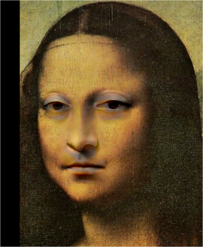
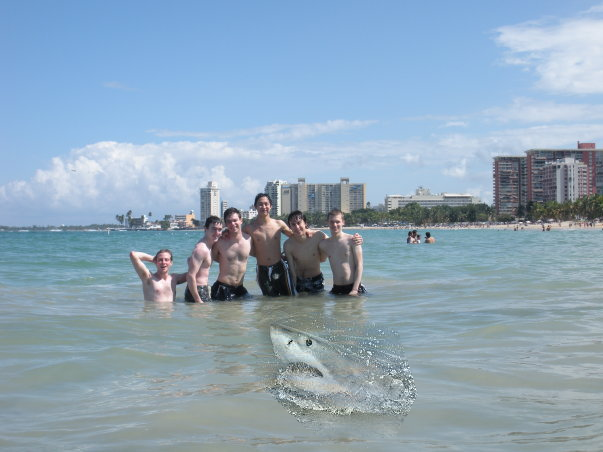

# Assignment 2 - DIP with PyTorch


## Implement traditional DIP (Poisson Image Editing) and deep learning-based DIP (Pix2Pix) with PyTorch.

This repository is zjx's implementation of Assignment_02 of DIP. 

## Installation

To install requirements:

```setup
conda create --name DIPwithPyTorch python=3.8
conda activate DIPwithPyTorch
pip install torch==2.2.1 torchvision==0.17.1 torchaudio==2.2.1 --index-url https://download.pytorch.org/whl/cu121
pip install gradio
```
## Datasets

Download the datasets using the following script.`cityscapes`: 2975 images from the [Cityscapes training set](https://www.cityscapes-dataset.com/).

```
bash download_dataset.sh cityscapes
```

## Running

To run Poisson Image Editing, run:

```
python run_blending_gradio.py
```

To run Pix2Pix, run:

```
python train.py
```

## Results 
### Poisson Image Editing:




### Pix2Pix:


## Acknowledgement

>📋 Thanks for the algorithms proposed by [Paper: Poisson Image Editing](https://www.cs.jhu.edu/~misha/Fall07/Papers/Perez03.pdf),[Paper: Image-to-Image Translation with Conditional Adversarial Nets](https://phillipi.github.io/pix2pix/),[Paper: Fully Convolutional Networks for Semantic Segmentation](https://arxiv.org/abs/1411.4038).
