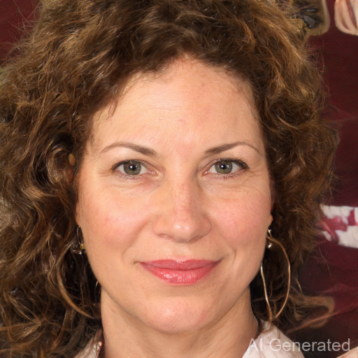

# Automatically Edit Faces

 
## Installation

To install requirements:

```setup
conda create -n stylegan3 python==3.10 -y
conda activate DIPwithPyTorch
pip3 install torch torchvision torchaudio --index-url https://download.pytorch.org/whl/cu121
pip install -r requirements.txt
pip install face-alignment
```

## Running

run:

```
python gradio.py
```
Click the effect(smile,close_eyes,close_mouth,enlarge_eyes,face_slimming) you want to achieve, then click Start.


## Results 

### close eyes:


### close mouth:




## Acknowledgement
- [DragGAN](https://vcai.mpi-inf.mpg.de/projects/DragGAN/): [Implementaion ](https://github.com/XingangPan/DragGAN) 
- [Facial Landmarks Detection](https://github.com/1adrianb/face-alignment)
