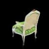
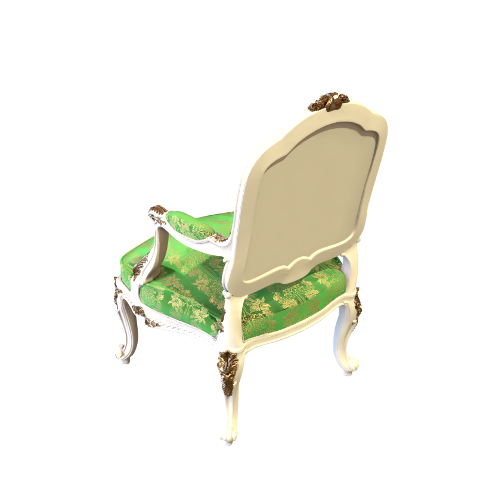
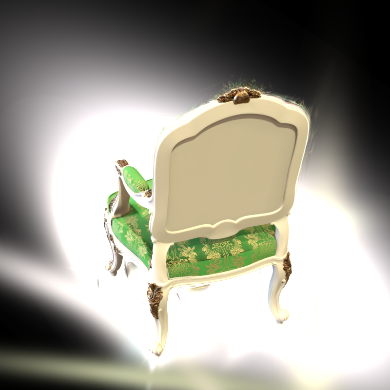

# Assignment 4 - Implement Simplified 3D Gaussian Splatting

 
## Installation

To install requirements:

```setup
conda create --name 3DGS python=3.8
conda activate 3DGS
conda install pytorch==2.4.1 torchvision==0.19.1 torchaudio==2.4.1  pytorch-cuda=11.8 -c pytorch -c nvidia
```
## Datasets

The following steps use the [chair folder](data/chair)


## Running

First, we use Colmap to recover camera poses and a set of 3D points. Please refer to [11-3D_from_Multiview.pptx](https://rec.ustc.edu.cn/share/705bfa50-6e53-11ef-b955-bb76c0fede49) to review the technical details.
```
python mvs_with_colmap.py --data_dir data/chair
```

Debug the reconstruction by running:
```
python debug_mvs_by_projecting_pts.py --data_dir data/chair
```
build 3DGS model:
```
python train.py --colmap_dir data/chair --checkpoint_dir data/chair/checkpoints
```

## Results 

重建椅子

1. 作业结果：

    | input | output |
    | --- | --- |
    |  |  |

2. 原版高斯效果

    | input | output |
    | --- | --- |
    |  |  |

## Resources:
- [Paper: 3D Gaussian Splatting](https://repo-sam.inria.fr/fungraph/3d-gaussian-splatting/)
- [3DGS Official Implementation](https://github.com/graphdeco-inria/gaussian-splatting)
- [Colmap for Structure-from-Motion](https://colmap.github.io/index.html)

